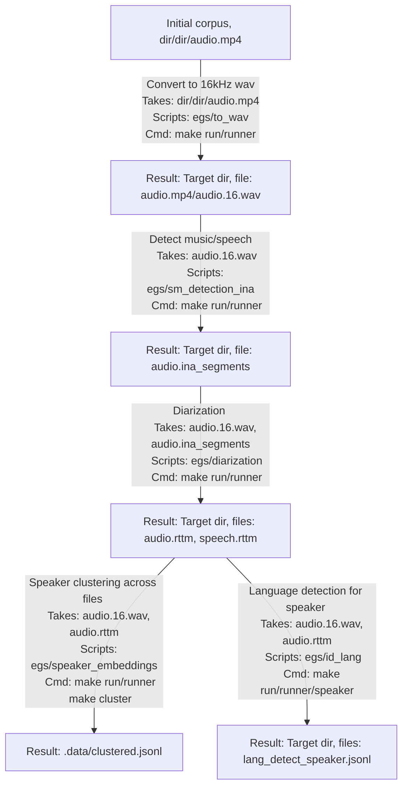

# training-asr-nxt

Script for the preparation of a corpus

## Installation
1. Creare a Python env: `conda create --name tasr python=3.12`
2. Install requirements: `make install/req`
3. Install additional packages (pip somehow do not work): `pip install --cache-dir ..... torchaudio torch speechbrain pyannote.audio faiss-cpu`

## Flow

